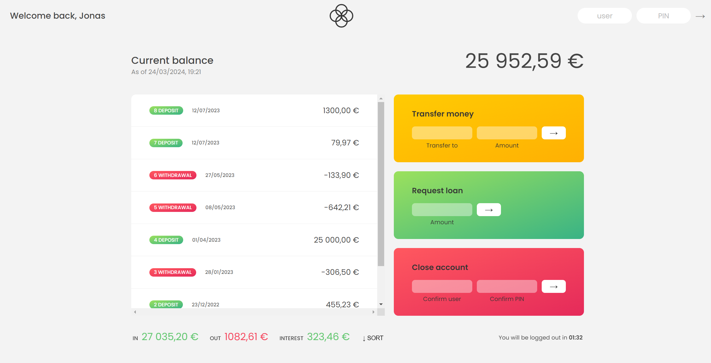

# Простое Банковское Приложение на JavaScript

## Обзор
Этот проект представляет собой легковесное банковское приложение, созданное для демонстрации основных навыков веб-разработки, включая HTML, CSS и JavaScript. Приложение функционирует без бэкенда и хранит все данные пользователей и транзакции в массивах JavaScript.

## Функциональность
- **Авторизация пользователя:** Вход в систему осуществляется с использованием имени пользователя и PIN-кода, данные для которых заданы в массивах JavaScript.
- **Просмотр баланса:** Пользователи могут видеть свой текущий баланс и историю последних операций.
- **Переводы средств:** Осуществление переводов другим пользователям внутри системы.
- **Запрос кредита:** Возможность запрашивать кредит на основе текущего баланса пользователя.
- **Закрытие аккаунта:** Пользователи могут закрыть свой аккаунт через приложение.

## Технологии
- **HTML:** для структурирования приложения.
- **CSS:** для стилизации приложения.
- **JavaScript:** для логики работы приложения, обработки пользовательских данных и выполнения транзакций.

## Интерфейс
Главный экран показывает приветственное сообщение, текущий баланс аккаунта, а также опции для осуществления транзакций и управления аккаунтом. На нижней панели отображается общая сумма входящих и исходящих операций, а также начисленные проценты.

## Запуск проекта
Чтобы запустить это приложение локально с помощью Live Server:

1. Установите [Visual Studio Code](https://code.visualstudio.com/), если вы этого ещё не сделали.
2. Установите расширение [Live Server](https://marketplace.visualstudio.com/items?itemName=ritwickdey.LiveServer).
3. Клонируйте репозиторий приложения на свой локальный компьютер.
4. Откройте папку проекта в Visual Studio Code.
5. Перейдите в файл `index.html`.
6. Нажмите правой кнопкой мыши на файл и выберите `Open with Live Server`, или воспользуйтесь комбинацией клавиш `Alt+L Alt+O`.
7. Ваш браузер автоматически откроет приложение по адресу `http://127.0.0.1:5500/` или другому порту, если 5500 уже используется.

